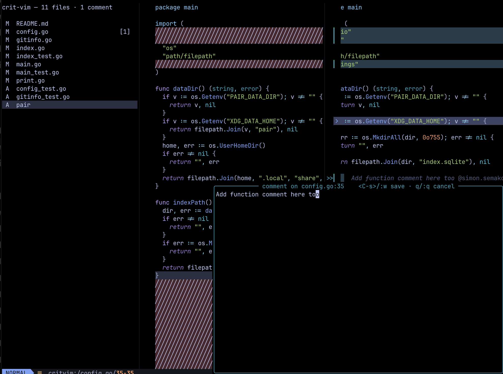

# crit-vim



Nvim-native client for [tomasz-tomczyk/crit](https://github.com/tomasz-tomczyk/crit).
Attaches to a running crit daemon, gives you a vim buffer per changed file
with inline comment cards, and rides on crit's schema for threads, resolve
state, multi-round tracking, PR sync, and share.

## Why

crit ships an excellent TUI and browser UI, and its schema handles the hard
parts (rounds, threads, resolve, atomic writes, per-branch persistence,
GitHub sync). But not everyone wants to leave Neovim to review a diff. This
plugin puts the whole review inside your existing nvim while delegating all
session state to the crit daemon — so both the browser and nvim stay in
sync in real time via SSE, and you don't lose comments when nvim restarts.

## Features

- One nvim tab per changed file with the base as a `:diffthis` left pane.
- Comments render as bordered floating cards with a colored gutter bar.
- Multi-line word-wrap; threaded replies render inline; resolved comments
  can be dimmed with strikethrough or hidden entirely.
- Real-time sync: comments authored in a browser tab or with `crit comment`
  appear in your nvim within milliseconds (SSE).
- Threads, resolve toggle, multi-round, PR-sync (via `crit pull`/`push`),
  share (via `crit share`) — all available because crit handles them.

## Install

**1. Install crit (the daemon).**

```sh
brew install crit
# or:
go install github.com/tomasz-tomczyk/crit/cmd/crit@latest
```

**2. Install the plugin.**

lazy.nvim / LazyVim — drop this in `~/.config/nvim/lua/plugins/crit-vim.lua`:

```lua
return {
  {
    dir = "/path/to/crit-vim",
    name = "crit-vim",
    lazy = false, -- need VimEnter to register the socket on startup
    keys = {
      { "<leader>C",  "<Plug>(CritComment)",     mode = { "n", "x" }, desc = "Crit: comment" },
      { "<leader>CC", "<Plug>(CritCommentLine)", mode = "n",          desc = "Crit: comment line" },
      { "<leader>Cr", "<Plug>(CritReply)",       mode = "n",          desc = "Crit: reply" },
      { "<leader>Cx", "<Plug>(CritResolve)",     mode = "n",          desc = "Crit: toggle resolve" },
    },
  },
}
```

Classic vim runtime:

```vim
set runtimepath+=/path/to/crit-vim
```

**3. Put the CLI on `$PATH`.**

```sh
ln -s /path/to/crit-vim/bin/crit-vim ~/bin/crit-vim
```

**4. Verify.**

```sh
crit-vim doctor
```

Should list your nvim's socket + crit binary + session-file path.

Requires: Neovim 0.10+, `git`, `curl`, `python3`, `bash`, `crit` >= 0.18.

## Usage

You need two things:

1. **Your nvim**, open in the repo of interest, with the plugin loaded.
2. **A shell** where you (or the agent) can run `crit-vim review`.

```sh
crit-vim review                      # crit's default (usually branch vs main)
crit-vim review --base HEAD          # only my uncommitted work (== --scope unstaged)
crit-vim review --scope unstaged     # working tree only
crit-vim review --scope branch       # branch commits only
crit-vim review --scope all          # branch commits + working tree
```

`crit-vim review` spawns a crit daemon (if none is running for this
cwd+branch), waits for it to become ready, tells nvim to attach, and
blocks until you finish the review (either from nvim via `:CritFinish` or
from a browser tab).

On attach the plugin prints the effective scope so you're not surprised:

```
crit-vim: 1 file(s) · round 1 · scope=unstaged (vs main) — :CritFinish to submit
```

Binary files are skipped automatically (detected via a NUL byte in the
first 8KB of `git show`).

In nvim, one diff tab opens per changed file, with a sidebar on the left
listing files and comment counts. `<CR>` on a sidebar row jumps to that
file, `q` closes the sidebar, `R` refreshes.

### Authoring comments

Pick a range, then drop into a floating comment buffer:

| To comment on...                 | Do this                                                         |
| -------------------------------- | --------------------------------------------------------------- |
| the current line                 | `<leader>CC`                                                    |
| a paragraph                      | `<leader>Cap` (operator + text-object)                          |
| this line and the next 4         | `<leader>C4j` (operator + count + motion)                       |
| a visual selection               | `V` / `v` → move → `<leader>C`                                  |
| an explicit line range           | `:42,55CritComment`                                             |

Inside the floating buffer:

| Keys                                | Behaviour              |
| ----------------------------------- | ---------------------- |
| `<C-s>` (normal+insert), `:w`, `ZZ` | save the comment       |
| `q` (normal), `:q!`                 | cancel without saving  |

### Threads + resolve

| Command / Keymap        | Behaviour                                                        |
| ----------------------- | ---------------------------------------------------------------- |
| `:CritReply`            | Reply to the comment under the cursor (opens the comment buffer) |
| `:CritEditReply`        | Pick a reply of the comment under cursor and edit it             |
| `:CritDeleteReply`      | Pick a reply and delete it (prompts y/N)                         |
| `:CritResolve`          | Mark the comment under the cursor as resolved                    |
| `:CritUnresolve`        | Mark the comment under the cursor as unresolved                  |
| `:CritToggleResolved`   | Show or hide resolved comments in this session                   |
| `<Plug>(CritResolve)`   | Toggle resolved (compact one-key binding)                        |

Reply threads render inside the same bordered card as the parent comment,
separated by a horizontal divider and prefixed with `↳ @author`. Resolved
comments render dimmed with a strikethrough body (or hide entirely when
`:CritToggleResolved` is off).

### Managing comments

| Command        | Behaviour                                          |
| -------------- | -------------------------------------------------- |
| `:CritEdit`    | edit comment under cursor                          |
| `:CritDelete`  | delete comment under cursor (prompts y/N)          |
| `:CritList`    | quickfix list of all comments                      |
| `:CritSidebar` | toggle the file list sidebar in this tab           |
| `:CritReopen`  | rebuild diff tabs + sidebars (after `<C-w>o` etc.) |
| `:CritScope [name]` | switch scope on the fly (unstaged/staged/branch/all); no arg = show current |

### Editing during review

The right side of every modified or added file is the real working-tree
file. Edits with `:w` write through to disk; the agent (and any other
review surface) sees the change on next round.

### Submitting the review

| Command       | Behaviour                                                                                    |
| ------------- | -------------------------------------------------------------------------------------------- |
| `:CritFinish` | POST `/api/finish`, stop the daemon; the CLI prints comments as JSON to stdout, exits 0.     |
| `:CritCancel` | Stop the daemon and withhold comments from the agent; CLI exits 1 without printing anything. |

`:CritCancel` writes a sentinel at `~/.crit-vim/last-cancel` before killing
the daemon; the CLI checks it before printing comments so cancelled reviews
never reach the agent. Comments remain in the review file for the next
`crit-vim review` in the same repo+branch.

### Debugging

| Command / File             | What it gives you                                     |
| -------------------------- | ----------------------------------------------------- |
| `:CritVersion`             | plugin + `crit` CLI + session summary + daemon health |
| `:CritLog`                 | open `~/.crit-vim/debug.log` (append-only) in a tab   |
| `crit-vim doctor`          | nvim socket + crit binary + plugin freshness         |
| `~/.crit-vim/debug.log`    | timestamped log of attach + errors; shareable        |

## Cross-surface parity

Because the daemon is authoritative and both surfaces subscribe to
`/api/events` (SSE), you can:

- Author a comment in nvim; a colleague sees it appear in the browser tab.
- Have the agent `crit comment ...` from another shell; nvim renders it live.
- `crit pull <PR#>` to import review comments from a GitHub PR — they show
  up in nvim without an nvim reload.

## CLI commands

| Command                                    | What it does                                            |
| ------------------------------------------ | ------------------------------------------------------- |
| `crit-vim review [--base REF] [--scope N]` | ensure crit daemon, attach nvim, block on `:CritFinish` |
| `crit-vim status`                          | proxy to `crit status --json`                           |
| `crit-vim doctor`                          | diagnose nvim socket + crit binary + plugin freshness   |

`crit-vim review` flags:
- `--base HEAD` — shortcut for `--scope unstaged`.
- `--base <ref>` — pass `--range <ref>..HEAD` to `crit`.
- `--scope <name>` — narrow to a subset of the branch diff (`unstaged`,
  `staged`, `branch`, `all`). Applied via `GET /api/session?scope=...`
  after the daemon comes up; the plugin diffs against `HEAD` for
  unstaged/staged so the left side reflects the immediately-preceding
  state.
- `--open-browser` — also open a browser tab alongside nvim (default:
  nvim only).

## `<Plug>` API

The plugin exposes these `<Plug>` mappings; bind them to whatever keys
you prefer.

| Mapping                       | Modes | Purpose                          |
| ----------------------------- | ----- | -------------------------------- |
| `<Plug>(CritComment)`         | n, x  | operator + visual comment        |
| `<Plug>(CritCommentLine)`     | n     | comment on current line          |
| `<Plug>(CritReply)`           | n     | reply to comment under cursor    |
| `<Plug>(CritResolve)`         | n     | toggle resolved                  |

They silently no-op outside an active review, so binding them globally is
safe. Or shortcut:

```lua
require("crit-vim").setup({ default_keys = true })
-- binds <leader>C, <leader>CC, <leader>Cr, <leader>Cx.
```

## Socket discovery

The CLI looks for your nvim in this order:

1. `--socket <path>`
2. `$CRIT_VIM_SOCKET`
3. `$NVIM` (set by nvim for processes spawned from `:terminal`)
4. `~/.crit-vim/sockets/<sha256(repo_root)>` (registry the plugin maintains)

## Agent integration

Skill manifests live under `integrations/`:

```
integrations/claude-code/skills/crit-vim/SKILL.md
integrations/codex/skills/crit-vim/SKILL.md
```

Copy or symlink `crit-vim/` into your agent's skills directory. The agent
runs `crit-vim review`, blocks until you `:CritFinish`, reads the JSON,
edits files, optionally starts another round with `crit-vim review`.

## Troubleshooting

- **`crit-vim: crit ... is not installed`** — install crit (`brew install
  crit`).
- **`crit daemon /api/session never became ready`** — the daemon crashed
  during startup. Check `~/.crit/sessions/<key>.log`.
- **`crit-vim: cannot find a running nvim`** — start nvim in the repo, or
  export `CRIT_VIM_SOCKET`. Run `crit-vim doctor` for details.

## How it hangs together

- Session state lives in `~/.crit/reviews/<key>/review.json` (crit owns this).
- Daemon serves it at `http://127.0.0.1:<port>/api/*`.
- Plugin reads `review.json` for comment data (atomic, cheap) and posts to
  `/api/*` for writes. Any change (from us, the browser, or `crit comment`)
  fires SSE `comments-changed`; the plugin re-reads `review.json` and
  re-renders.
- Per-branch review persistence is inherited from crit — kill nvim and
  restart, `crit-vim review` re-attaches to the same review with all your
  comments intact.

## Smoke test

```sh
./test/smoke.sh
```

Spawns a headless nvim, wires up an ephemeral git repo, runs `crit-vim
review`, plants a comment via `/api/file/comments`, `:CritFinish`, and
asserts the returned JSON.
